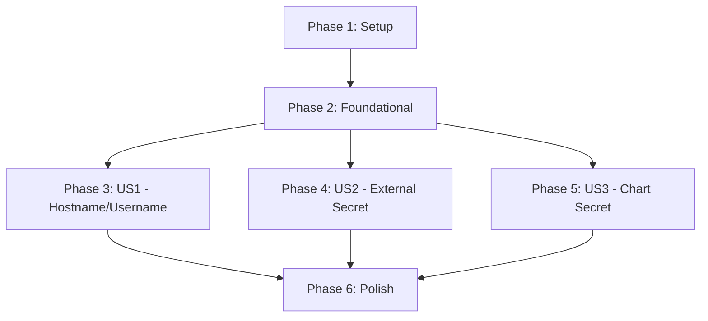

# Tasks: Enable configuration of username, hostname, and password secret in Helm chart

**Spec**: `specs/003-helm-auth-config/spec.md`
**Plan**: `specs/003-helm-auth-config/plan.md`

## Dependencies

## Phase 1: Setup
**Goal**: Initialize feature branch and validate environment.

- [x] T001 Verify Helm and Kubernetes client tools are installed (manual check)
- [x] T002 Verify local cluster access for testing (manual check)

## Phase 2: Foundational
**Goal**: Establish the configuration structure in `values.yaml` and basic template references.

- [x] T003 Update `charts/prometheus-exporter-jdbc/values.yaml` with new `env` structure (hostname, username defaults)
- [x] T004 Update `charts/prometheus-exporter-jdbc/values.yaml` with new `secret` structure (create, name, key, password defaults)
- [x] T005 [P] Create `charts/prometheus-exporter-jdbc/templates/secret.yaml` with conditional creation logic
- [x] T006 [P] Add helper template for secret name resolution in `charts/prometheus-exporter-jdbc/templates/_helpers.tpl`

## Phase 3: User Story 1 - Configure Hostname and Username (Priority: P1)
**Goal**: Allow specifying database hostname and username via Helm values.
**Independent Test**: Deploy with `env.hostname` and `env.username` set, verify `HOSTNAME` and `USERNAME` env vars in Pod.

- [x] T007 [US1] Update `charts/prometheus-exporter-jdbc/templates/deployment.yaml` to inject `HOSTNAME` from `.Values.env.hostname`
- [x] T008 [US1] Update `charts/prometheus-exporter-jdbc/templates/deployment.yaml` to inject `USERNAME` from `.Values.env.username`
- [x] T009 [US1] Verify hostname and username injection with a dry-run install

## Phase 4: User Story 2 - Secure Password Injection via External Secret (Priority: P1)
**Goal**: Reference an existing secret for the database password.
**Independent Test**: Deploy with `secret.create=false` and `secret.name` set to an existing secret, verify `PASSWORD` env var from secret.

- [x] T010 [US2] Update `charts/prometheus-exporter-jdbc/templates/deployment.yaml` to inject `PASSWORD` using `valueFrom.secretKeyRef` referencing the configured secret name and key
- [x] T011 [US2] Verify external secret reference with a dry-run install

## Phase 5: User Story 3 - Chart-Managed Secret Creation (Priority: P2)
**Goal**: Optionally create the secret containing the password within the chart.
**Independent Test**: Deploy with `secret.create=true` and `secret.password` set, verify Secret creation and Pod linkage.

- [x] T012 [US3] Implement logic in `charts/prometheus-exporter-jdbc/templates/secret.yaml` to only create secret when `.Values.secret.create` is true
- [x] T013 [US3] Ensure `charts/prometheus-exporter-jdbc/templates/secret.yaml` populates data from `.Values.secret.password` (base64 encoded automatically by Helm/K8s or manual pipe if needed)
- [x] T014 [US3] Verify chart-managed secret creation with a dry-run install

## Phase 6: Polish & Cross-Cutting Concerns
**Goal**: Final cleanups, documentation updates, and end-to-end verification.

- [x] T015 Validate `charts/prometheus-exporter-jdbc/Chart.yaml` version bump (if not handled by CI)
- [x] T016 Run full `helm lint charts/prometheus-exporter-jdbc`
- [x] T017 Update `charts/prometheus-exporter-jdbc/README.md` with new configuration options documentation
- [x] T019 Run Trivy vulnerability scan on Helm chart (Constitution Requirement)
- [x] T018 Perform end-to-end manual deployment test on a local cluster

## Implementation Strategy
- **MVP**: Complete Phase 2 and Phase 3 to allow basic connection config.
- **Incremental**: Add Secret support (Phase 4 & 5) immediately after basic env vars to complete the auth story.
- **Verification**: Use `helm template` (dry-run) frequently to check manifest output without needing a full cluster for every change.