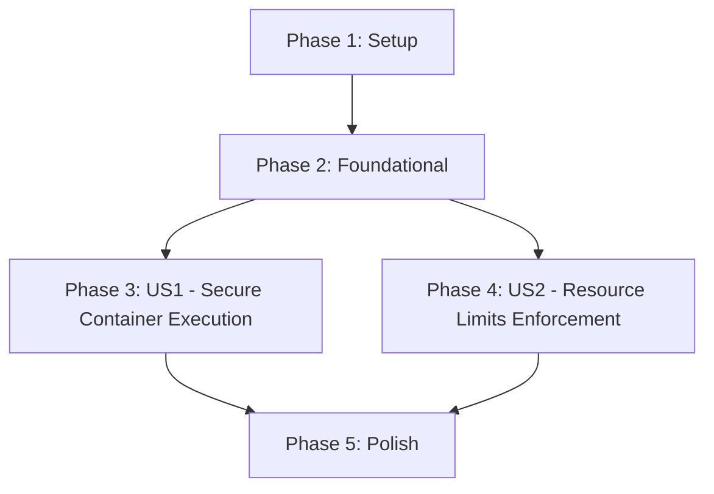

# Tasks: Address Security Concerns

**Spec**: `specs/004-security-fixes/spec.md`
**Plan**: `specs/004-security-fixes/plan.md`

## Dependencies

## Phase 1: Setup
**Goal**: Initialize feature branch and validate environment.

- [x] T001 Verify Helm and Trivy are installed (manual check)
- [x] T002 Verify local cluster access for testing (manual check)

## Phase 2: Foundational
**Goal**: Establish the secure configuration structure in `values.yaml`.

- [x] T003 Update `charts/prometheus-exporter-jdbc/values.yaml` with `podSecurityContext` defaults (runAsNonRoot, runAsUser, etc.)
- [x] T004 Update `charts/prometheus-exporter-jdbc/values.yaml` with `securityContext` defaults (readOnlyRootFilesystem, capabilities, etc.)
- [x] T005 Update `charts/prometheus-exporter-jdbc/values.yaml` with `resources` defaults (requests/limits)

## Phase 3: User Story 1 - Secure Container Execution (Priority: P1)
**Goal**: Configure the Deployment to use strict security contexts for the Pod and Container.
**Independent Test**: Deploy chart, verify Pod security context matches values, and root FS is read-only.

- [x] T006 [US1] Update `charts/prometheus-exporter-jdbc/templates/deployment.yaml` to apply `.Values.podSecurityContext` to the Pod spec
- [x] T007 [US1] Update `charts/prometheus-exporter-jdbc/templates/deployment.yaml` to apply `.Values.securityContext` to the Container spec
- [x] T008 [US1] Explicitly set `allowPrivilegeEscalation: false` in `charts/prometheus-exporter-jdbc/templates/deployment.yaml` if not covered by values mapping
- [x] T009 [US1] Verify security context with a dry-run install (`helm template`)

## Phase 4: User Story 2 - Resource Limits Enforcement (Priority: P2)
**Goal**: Apply CPU and Memory resource limits to the container.
**Independent Test**: Deploy chart, verify Pod spec resources match configured values.

- [x] T010 [US2] Update `charts/prometheus-exporter-jdbc/templates/deployment.yaml` to apply `.Values.resources` to the Container spec
- [x] T011 [US2] Verify resource application with a dry-run install (`helm template`)

## Phase 5: Polish & Cross-Cutting Concerns
**Goal**: Final cleanups, documentation updates, and security verification.

- [x] T012 Validate `charts/prometheus-exporter-jdbc/Chart.yaml` version bump (if not handled by CI)
- [x] T013 Run full `helm lint charts/prometheus-exporter-jdbc`
- [x] T014 Update `charts/prometheus-exporter-jdbc/README.md` with new security and resource configuration options
- [x] T015 Run Trivy vulnerability scan on Helm chart to verify fix (Constitution Requirement)
- [x] T016 Perform end-to-end manual deployment test on a local cluster

## Implementation Strategy
- **Security First**: Implement US1 immediately to address critical findings.
- **Resource Hygiene**: Implement US2 concurrently or immediately after.
- **Verification**: Use `helm template` for syntax and structure, `trivy` for compliance verification.
