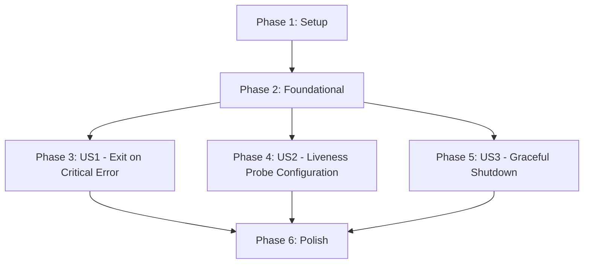

# Tasks: Implement Auto-Restart Mechanism

**Spec**: `specs/005-auto-restart/spec.md`
**Plan**: `specs/005-auto-restart/plan.md`

## Dependencies

## Phase 1: Setup
**Goal**: Initialize feature branch and validate environment.

- [x] T001 Verify Helm and Java build tools (Maven) are installed (manual check)
- [x] T002 Verify local cluster access for testing (manual check)

## Phase 2: Foundational
**Goal**: Prepare the codebase for restart mechanisms.

- [x] T003 Check `src/main/java/com/ibm/jesseg/prometheus/MainApp.java` for existing exception handling logic

## Phase 3: User Story 1 - Exit on Critical Error (Priority: P1)
**Goal**: Ensure the application exits with non-zero code on failure.
**Independent Test**: Run with invalid config, verify exit code is 1.

- [x] T004 [US1] Modify `src/main/java/com/ibm/jesseg/prometheus/MainApp.java` to call `System.exit(1)` in the main try-catch block for unrecoverable errors
- [x] T005 [US1] Modify `src/main/java/com/ibm/jesseg/prometheus/MainApp.java` to call `System.exit(1)` if `config.json` initialization fails (if not already handled)
- [ ] T006 [US1] Build the JAR locally (`mvn clean package`) and verify exit code with invalid config

## Phase 4: User Story 2 - Liveness Probe Configuration (Priority: P2)
**Goal**: Configure Kubernetes to restart the container if it hangs.
**Independent Test**: Deploy chart, verify livenessProbe in Pod spec.

- [x] T007 [US2] Update `charts/prometheus-exporter-jdbc/templates/deployment.yaml` to add `livenessProbe` configuration using values from `contracts/probes.yaml`
- [x] T008 [US2] Update `charts/prometheus-exporter-jdbc/templates/deployment.yaml` to add `readinessProbe` configuration
- [x] T009 [US2] Verify chart syntax with `helm template`

## Phase 5: User Story 3 - Graceful Shutdown (Priority: P2)
**Goal**: Ensure clean resource cleanup on termination.
**Independent Test**: Send SIGTERM, verify logs.

- [x] T010 [US3] Modify `src/main/java/com/ibm/jesseg/prometheus/MainApp.java` to add a JVM Shutdown Hook that logs shutdown and stops the server
- [x] T011 [US3] Ensure `server.stop()` is called during shutdown hook execution

## Phase 6: Polish & Cross-Cutting Concerns
**Goal**: Final cleanups, documentation updates, and verification.

- [x] T012 Run full `helm lint charts/prometheus-exporter-jdbc`
- [x] T013 Update `charts/prometheus-exporter-jdbc/README.md` to document the new probe configurations
- [x] T014 Run Trivy vulnerability scan on Helm chart (Constitution Requirement)
- [ ] T015 Build Docker image locally (optional, for manual verification) or verify CI build passes
- [x] T016 Perform end-to-end manual deployment test on a local cluster

## Implementation Strategy
- **Code First**: Implement Java changes (exit code, shutdown hook) first.
- **Chart Second**: Update Helm chart with probes.
- **Verification**: Verify locally before pushing.
