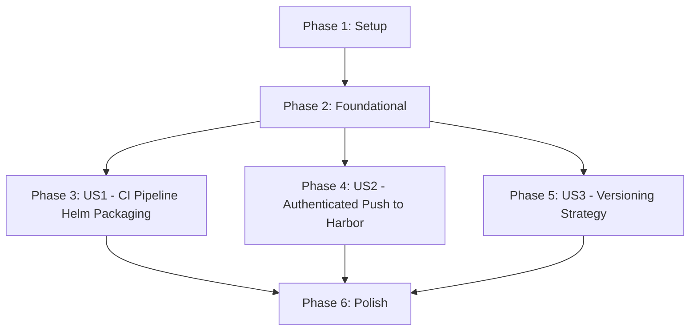

# Tasks: Azure DevOps Helm Chart Push to Harbor

**Spec**: `specs/006-azure-helm-push/spec.md`
**Plan**: `specs/006-azure-helm-push/plan.md`

## Dependencies

## Phase 1: Setup
**Goal**: Initialize feature branch and validate environment.

- [x] T001 Verify Helm CLI is available locally for testing syntax (manual check)
- [x] T002 Verify Azure DevOps pipeline YAML extension support (manual check)

## Phase 2: Foundational
**Goal**: Establish the pipeline file and basic structure.

- [x] T003 Create `azure-pipelines-helm.yml` at project root with basic trigger definition (main branch, charts path)
- [x] T004 Add HelmInstaller task to `azure-pipelines-helm.yml`

## Phase 3: User Story 1 - CI Pipeline Helm Packaging (Priority: P1)
**Goal**: Automate linting and packaging of the Helm chart.
**Independent Test**: Commit a change to charts and verify `.tgz` artifact generation.

- [x] T005 [US1] Add `helm lint` step to `azure-pipelines-helm.yml`
- [x] T006 [US1] Add `helm package` step to `azure-pipelines-helm.yml` targeting `charts/prometheus-exporter-jdbc`
- [x] T007 [US1] Add PublishPipelineArtifact step to publish the `.tgz` file (optional but good for debugging/history)

## Phase 4: User Story 2 - Authenticated Push to Harbor (Priority: P1)
**Goal**: Push the packaged chart to the Harbor OCI registry.
**Independent Test**: Verify chart appears in Harbor after pipeline run.

- [x] T008 [US2] Define variable group `HarborCredentials` usage in `azure-pipelines-helm.yml`
- [x] T009 [US2] Add script step to `azure-pipelines-helm.yml` for `helm registry login` using variables `$(HARBOR_URL)`, `$(HARBOR_USERNAME)`, `$(HARBOR_PASSWORD)` securely (pipe secret to `--password-stdin`, do NOT echo it)
- [x] T010 [US2] Add script step to `azure-pipelines-helm.yml` for `helm push *.tgz` to `oci://$(HARBOR_URL)/library`

## Phase 5: User Story 3 - Versioning Strategy (Priority: P2)
**Goal**: Ensure versioning respects `Chart.yaml` and handles conflicts.
**Independent Test**: Commit new version in `Chart.yaml`, verify correct tag in Harbor.

- [x] T011 [US3] Verify `helm package` step uses the version from `Chart.yaml` (default behavior, confirm no overrides needed)
- [x] T012 [US3] Add condition to Push step: only run if packaging succeeded (implicit, but ensure dependency)

## Phase 6: Polish & Cross-Cutting Concerns
**Goal**: Final cleanups, documentation updates, and security verification.

- [ ] T013 Run `helm lint charts/prometheus-exporter-jdbc` locally to ensure current chart is valid
- [ ] T014 Update `README.md` to mention the new CI/CD pipeline and variable group requirements
- [ ] T015 Run Trivy vulnerability scan on Helm chart (Constitution Requirement) - verification that pipeline doesn't break security posture

## Implementation Strategy
- **Pipeline First**: Create the YAML file iteratively.
- **Verification**: Since Azure DevOps pipelines run remotely, local verification is limited to syntax (`helm lint`) and structure.
